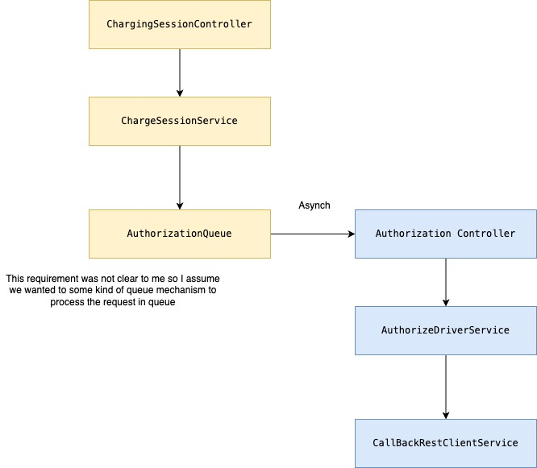

Application for Tracking Driver and Chargepoint
# ChargeIt - Charging Session Management

## Overview
ChargeIt is a Kotlin-based project designed to manage charging sessions for electric vehicles. It provides RESTful APIs for starting charging sessions, authorizing drivers, and handling asynchronous processing with callback URLs.

The project is built using:
- **Kotlin** and **Java**
- **Quarkus** framework for lightweight and fast microservices
- **Gradle** for build automation
- **Jakarta Validation** for input validation
- **MockServer** and **RestAssured** for testing

## Features
- Start a charging session with driver and station details.
- Asynchronous processing of charging sessions.
- Callback URL support for notifying the client about the session status.
- RESTful APIs with JSON support.

## Prerequisites
Before running the project, ensure you have the following installed:
- **Java 21** or higher
- **Gradle** (or use the Gradle wrapper included in the project)
- **Docker** (optional, for running MockServer)

## How to Run the Project

### 1. Clone the Repository
- git clone https://github.com/akashsharma3030/chargeIt.git

## 2. Run the Application via Docker Script

You can use the provided `run-docker.sh` script to build and run the application in a Docker container.

#### Steps:
1. Make the script executable:
   
   chmod +x run-docker.sh
   Run the script:
   ./run-docker.sh
   The application will be available at http://localhost:8080.

2. Run the Application Locally You can run the application directly using the `MainApplication` Kotlin class. Use the following command:

### 3. Swagger API Documentation is available at http://localhost:8080/swagger-ui/index.html#/

### 4. Architecture
     Vertical Slicing Architecture is used in this project. The application is divided into different modules, each responsible for a specific functionality.

#### ToDo:
Add more integration tests for the application.
